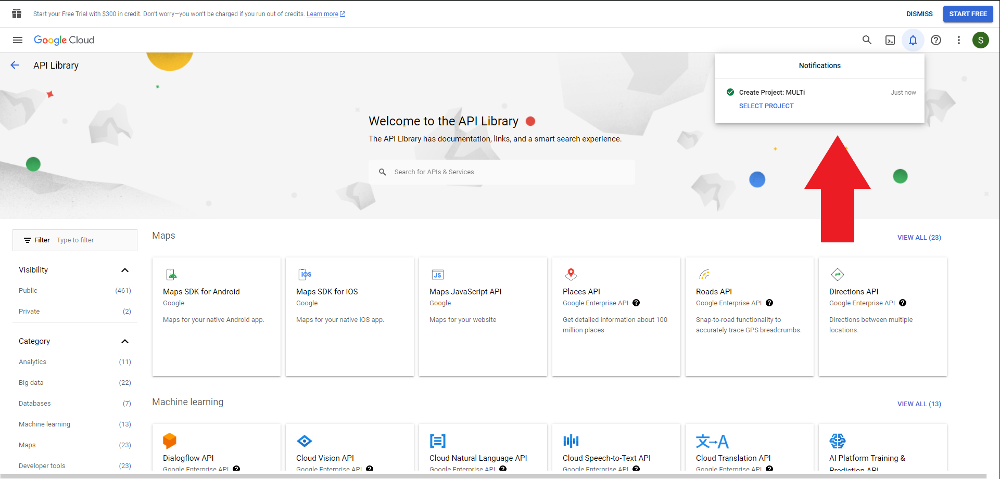
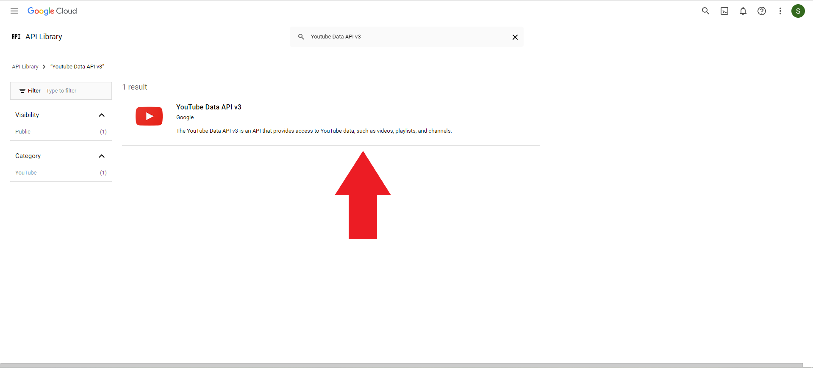

# MULTi

## Summary
MULTi is a  lightweight web app that can easily merge Youtube and Twitch livestream chats. When provided with a Youtube Channel ID, Twitch Channel ID, and a Google API Key multi will monitor the provided live streams for messages and display them together in one interface designed similarly to the Twitch chat interface.

## Input Setup

The following contains instructions on how to get the values needed for each of the form inputs.

### Youtube Channel ID
Youtube Channel IDs are publicly available, but can sometimes be tricky to find.

**Option 1:**
Log in to your Youtube channel and click on your avatar in the top right of the screen. Click on Settings > Advanced Settings, then you can copy the value listed as Channel ID.

**Option 2:**
Go to any video or livestream from the desired Youtube channel. Right click on the page background and click on "View Page Source" (or press Ctrl+U). On the page that opens press Ctrl+F and search the page for "channelid" and copy the value between the quotations associated with the listed channelId. eg.
"channelId":"ThisIsTheChannelIDValue".

### Twitch Channel ID
Twitch Channel IDs are also publicly available and are very easy to find. 

The Twitch channel ID value is found in the URL for the target channel. eg. twitch.tv/ThisIsTheChannelIDValue

### Google API Key
Google API Keys are private and requires some setup. In order to listen to Youtube livestream chats this app uses the Youtube Data API v3. This API is free to use but has a restricted amount of requests per day. In my testing the alloted bandwidth is enough to monitor most 4 - 6 hour daily streams.

1. Log in to your desired google account.

2. Head over to https://console.cloud.google.com/apis/library. You may be prompted to enter some information and agree to google's Terms of Service.

3. Near the top of your screen, click on the "Select a project" dropdown. This should open a modal that lists your current projects. At the top right of this modal click on "NEW PROJECT". 

4. The Project Name can be set to whatever you'd like but I would suggest naming it MULTi so it is easy to keep track of. The location can be left as "No organization". 

5. Click on "CREATE". It may take a few seconds but you should see a notification that your project has been created. 

6. In the search bar, type in "YouTube Data API v3", hit enter, and select the result. 

7. You will be prompted to "Select a recent project", here you can select the MULTi project you just created. 

8. Click the "ENABLE" button, wait a few seconds and you will be redirected to an API/Service Details page. 

9. You should now see a prompt to "CREATE CREDENTIALS". Click on this button. 

***IMPORTANT***: The API key you are about to view should be kept private. If you are sharing your screen this window should not be visible.

10. When prompted with: *What data will you be accessing?*, select "Public data" and click next. This will generate the API Key needed for MULTi. I recommend storing this key somewhere safe but easily accessible either in a saved document or a password manager. 

11. Click on "DONE". You can now exit the page.

### FAQs
In order to keep your Google API Key private MULTi currently does not store any of the data that you input. Accounts and settings may be added in the future but for now the Channel and API Keys will need to be entered any time you reload the app. 
